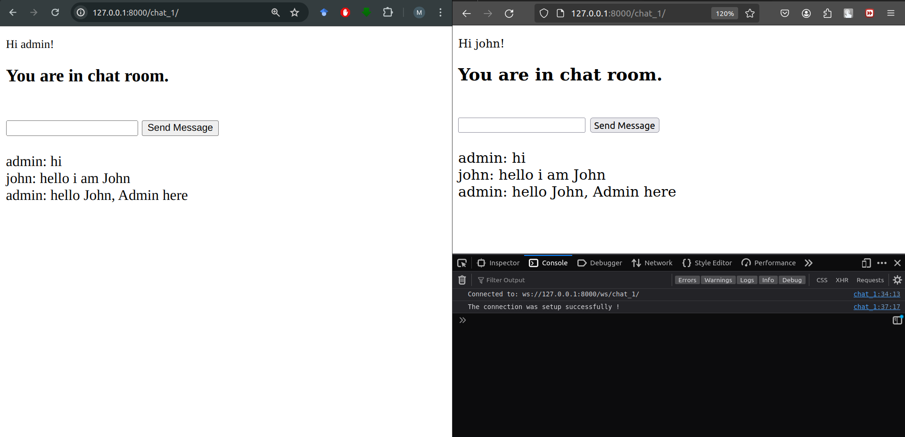

# demo-chat-app
A demo chat app using websocket in django

## Step 1:
A simple authorization from here
https://learndjango.com/tutorials/django-login-and-logout-tutorial

## Step 2:
Create a chatapp and add

### Add in settings.py

    INSTALLED_APPS = [
        'daphne',
        'channels',
        
        ................
        
        'chatapp'
    ]

    CHANNEL_LAYERS = {
        "default": {
            "BACKEND": "channels.layers.InMemoryChannelLayer"
        }
    }

    ASGI_APPLICATION = 'core.asgi.application'

### Add asgi.py

    # core/asgi.py
    import os
    from django.core.asgi import get_asgi_application
    
    os.environ.setdefault('DJANGO_SETTINGS_MODULE', 'ChatApp.settings')
    
    from channels.auth import AuthMiddlewareStack
    from channels.routing import ProtocolTypeRouter , URLRouter
    from chatapp import routing
    
    application = ProtocolTypeRouter(
        {
            "http" : get_asgi_application() , 
            "websocket" : AuthMiddlewareStack(
                URLRouter(
                    routing.websocket_urlpatterns
                )    
            )
        }
    )

### Add Routing.py

    # chatapp/Routing.py
    from django.urls import path , include, re_path
    from .consumers import ChatConsumer
    
    # Here, "" is routing to the URL ChatConsumer which 
    # will handle the chat functionality.
    websocket_urlpatterns = [
        re_path(r'^ws/(?P<room_slug>[^/]+)/$', ChatConsumer.as_asgi()),
    ]

### Add Consumers.py

    # chatapp/Consumers.py
    import json
    from channels.generic.websocket import AsyncWebsocketConsumer
    
    class ChatConsumer(AsyncWebsocketConsumer):
        async def connect(self):
            self.room_name = self.scope['url_route']['kwargs']['room_slug']
            self.roomGroupName = f'chat_{self.room_name}'
    
            await self.channel_layer.group_add(
                self.roomGroupName ,
                self.channel_name
            )
            await self.accept()
    
        async def disconnect(self , close_code):
            await self.channel_layer.group_discard(
                self.roomGroupName , 
                self.channel_layer 
            )
    
        async def receive(self, text_data):
            text_data_json = json.loads(text_data)
            message = text_data_json["message"]
            username = text_data_json["username"]
            await self.channel_layer.group_send(
                self.roomGroupName,{
                    "type" : "sendMessage" ,
                    "message" : message , 
                    "username" : username ,
                })
    
        async def sendMessage(self , event) : 
            message = event["message"]
            username = event["username"]
            await self.send(text_data = json.dumps({"message":message, "username":username}))

